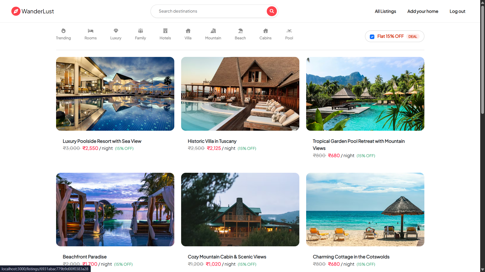
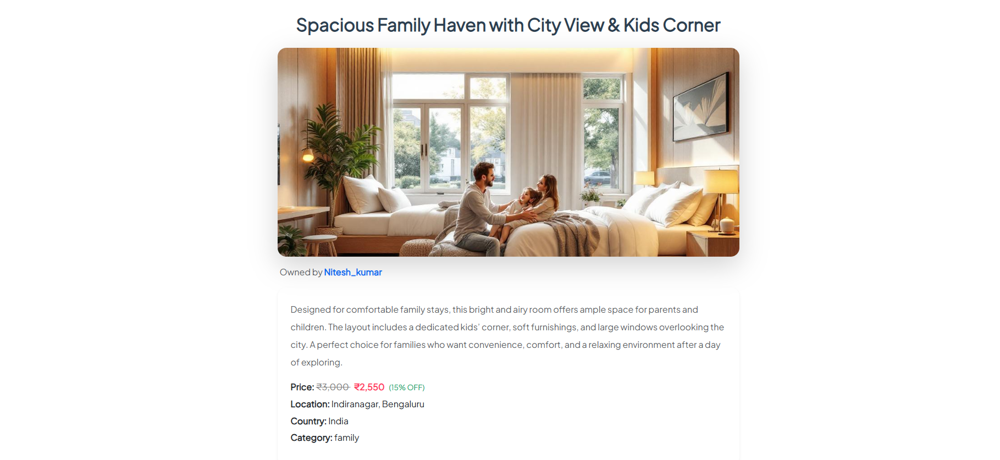
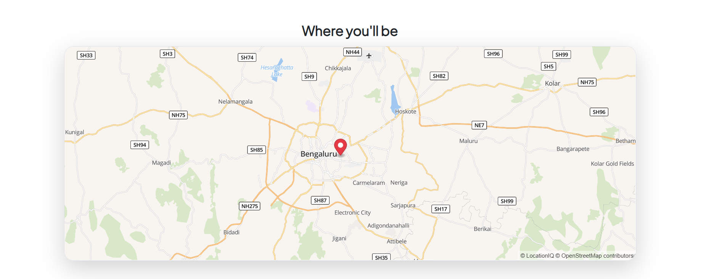

<!-- PROJECT TITLE -->
<h1  align="center">WanderLust</h1>

<p align="center">
  <b>Scalable Full Stack Travel Accommodation Platform</b><br/>
  Discover • List • Review • Explore
</p>

<p align="center">
  
  
  
  
  
  
</p>

---

## 📌 About The Project

WanderLust is a scalable full-stack travel accommodation platform engineered using **Node.js, Express.js, MongoDB, and EJS** following **MVC architecture principles**.

The application enables users to explore travel properties, create listings, leave reviews, and manage content securely with robust authentication and session management.


🚀 **[View Live Project](https://medicare-pr8s.onrender.com)**

_Deployed on Render with environment-based configuration._

---


## 📸 Screenshots

### 🏠 Home Page
<p align="center">
  
</p>
<p align="center"><i>Explore featured travel destinations and listings.</i></p>

---

### ➕ Add New Listing
<p align="center">
  
</p>
<p align="center"><i>Create and upload new property listings with images.</i></p>

---

### 📄 Listing Details
<p align="center">
  
</p>
<p align="center"><i>View property details, reviews, and ratings.</i></p>

---

### 🗺️ Map View
<p align="center">
  
</p>

<p align="center"><i>LocationIQ powered geocoding and map visualization.</i></p>

## 🚀 Core Features Highlights

- Implement a scalable travel accommodation platform using MVC architecture
-  Designed and implemented RESTful APIs enabling secure CRUD operations
-  Structured relational data modeling using MongoDB & Mongoose
-  Implemented secure authentication and authorization using
   Passport.js
   express-session
   connect-mongo
-  Added robust server-side input validation using Joi
-  Integrated Cloudinary-based image storage with Multer
-  Implemented search & filtering functionality for property discovery
-  Integrated LocationIQ-based geocoding & map visualization
-  Built a review and rating system with edit & delete permissions
-  Designed fully responsive UI using Bootstrap
-  Version control and collaboration via Git & GitHub

---

## 🛠️ Tech Stack

### 💻 Frontend
- HTML5
- CSS3
- Bootstrap
- JavaScript
- EJS (Templating Engine)

### ⚙️ Backend
- Node.js
- Express.js
- RESTful Routing
- MVC Architecture

### 🗄️ Database
- MongoDB
- Mongoose ODM

### 🔐 Authentication & Security
- Passport.js
- express-session
- connect-mongo
- Joi Validation

### ☁️ Cloud & APIs
- Cloudinary (Image Storage)
- Multer (File Upload)
- LocationIQ (Geocoding & Maps)
- Render
---

## 🗂️ Project Structure (MVC)
```
WanderLust/
│
├── models/
├── controllers/
├── routes/
├── views/
├── public/
├── layouts/
├── reviews/
├── listings/
├── pages/
├── utils/
├── middleware.js
├── .env
├── app.js
└── package.json

```
---


## ⚙️ Installation & Setup

```bash
# Clone the repository
git clone https://github.com/nitesh-kumar864/Wanderlust

# Navigate into project
cd wanderlust

# Install dependencies
npm install

# Create .env file and add:

DB_URL=your_mongodb_connection
SESSION_SECRET=your_session_secret
CLOUDINARY_CLOUD_NAME=your_cloud_name
CLOUDINARY_KEY=your_key
CLOUDINARY_SECRET=your_secret
LOCATIONIQ_TOKEN=your_locationiq_token

# Start server
npm start

```
